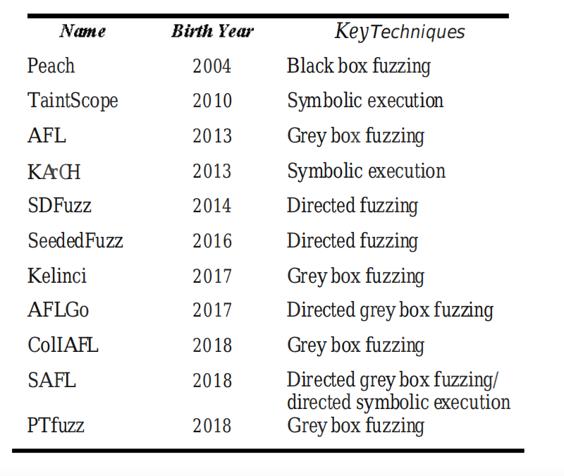

# 2023-5 论文阅读
- Fuzz

[TOC]

---
## Survey of Directed Fuzzy Technology
定向符号执行(DSE) 和 定向会和模糊(DGF)能够快速有效的发现漏洞！所以这篇文章介绍了：
1. 定向模糊测试技术的理论知识
定向模糊测试会将时间用在去寻找特定的目标位置上，具体的方法，是可以通过“污点分析”。DGF是一种基于GF实现定位的漏洞检测技术，用户可以一次指定多个目标位置。同时，用户可以给出一个初始的种子输入或一个空的输入，并可以模糊定向的灰框模糊器
并可以模糊定向的灰框模糊器

2. 工具

3. DGF的优缺点

---
